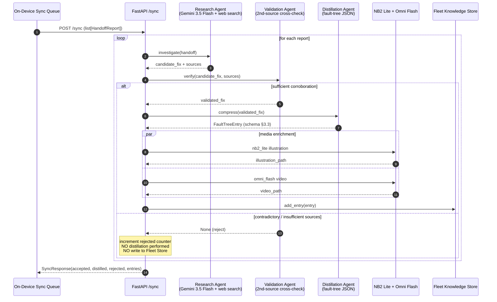

# Cloud Agent Pipeline — Research → Validation → Distillation

Deep-dive on `ARCHITECTURE.md` §4.1. Triggered when a device syncs a non-empty batch of `HandoffReport` objects (see `cloud/schemas.py`).

## Sequence Overview



## Agent-by-Agent

### 1. Research Agent

- **Model**: Gemini 3.5 Flash
- **Tool**: web search (Google Search API)
- **Input**: full `HandoffReport` — symptoms, ruled-out hypotheses, leading hypothesis, safety flag
- **Task**: search manufacturer service manuals, technician forums (r/Diesel, r/smallengines), OEM PDFs for the specific fault pattern given what's already been eliminated
- **Output**: a candidate fix **plus source URLs / snippets** — the sources are load-bearing for validation

### 2. Validation Agent

The rejection path is a first-class outcome, not an error state.

- **Input**: the candidate fix + Research Agent's cited sources
- **Task**: independently confirm the finding against a **second, unrelated source**. Concretely:
  - Re-query the web with a distinct query formulation
  - If a corroborating source is found → return the validated fix
  - If the two sources disagree, or only one source exists, or safety_flag is true and any contradiction is present → **return `None`**
- **Output**: validated fix, or `None`

**When `None` is returned:**
- `cloud/main.py` counts the report as `rejected`
- The Distillation Agent is **never invoked** for this report
- No entry is written to the Fleet Knowledge Store
- No media generation runs
- The device is expected to escalate to human review (per ARCHITECTURE.md §4.1)

This is by design: pushing a contradictory fix into every device's Local RAG would poison the fleet. Rejecting is cheaper than un-rejecting.

### 3. Distillation Agent

- **Input**: validated fix (natural-language repair procedure)
- **Task**: compress into the exact `FaultTreeEntry` schema (see `fault_trees/schema.json` and `cloud/schemas.py:FaultTreeEntry`)
- **Constraint**: output must schema-validate. Any generation the schema rejects is retried with a repair prompt; if two retries fail, the entry is dropped and counted as rejected.
- **Output**: `FaultTreeEntry` ready to write to the store and ship down on next sync

### 4. Media Enrichment (parallel, after Distillation)

- **NB2 Lite**: annotated diagnostic illustration, cached on the entry as `illustration_path`
- **Omni Flash**: short instructional repair video, cached as `video_path`

Media enrichment failures are non-fatal — the entry is still stored, the paths are just `null`.

## Response Shape

See `cloud/schemas.py:SyncResponse`:

```json
{
  "accepted": 3,     // count of incoming reports
  "distilled": 2,    // count that survived Validation + Distillation
  "rejected": 1,     // count Validation rejected OR pipeline errored on
  "entries": [ /* FaultTreeEntry[] */ ]
}
```

`accepted == distilled + rejected` always.

## Debugging the Pipeline

- Watch `uvicorn` logs — every stage logs at INFO
- Force the rejection path in a local test by mocking `research_agent` to return sources that contradict each other — `Validation Agent` must return `None` and `rejected` must increment by 1
- The Fleet Store defaults to in-memory; entries are lost on `uvicorn` restart (fine for demo, not for prod)
